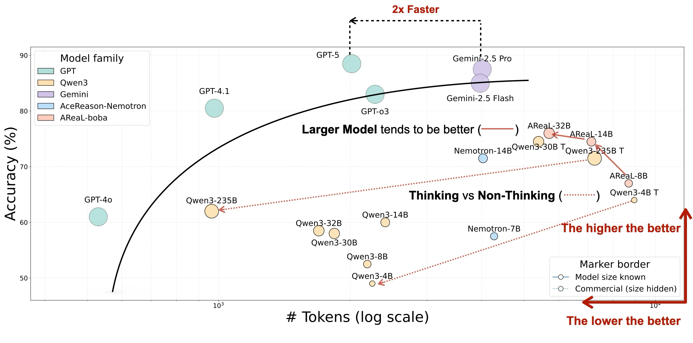

# OckBench ⚡️

**The Efficiency-Aware LLM Benchmark**

[](https://opensource.org/licenses/MIT)
[](https://www.python.org/downloads/)
[](https://hydra.cc/)

> *"Entia non sunt multiplicanda praeter necessitatem"* — William of Ockham

OckBench is the first LLM benchmark designed to measure **intelligence per token**. While traditional benchmarks focus solely on accuracy, OckBench evaluates the **efficiency-accuracy trade-off**, helping you identify models that solve complex reasoning tasks not just correctly, but elegantly.



---

## 🚀 Why OckBench?

As models grow larger and "reasoning" capabilities (Chain-of-Thought) become standard, the cost of inference is skyrocketing. OckBench answers the critical questions that other benchmarks miss:
- **How expensive is that 1% accuracy gain?**
- **Does Model A need 5x more tokens to solve the same problem as Model B?**
- **Is the "reasoning" actually contributing to the solution, or just bloating the context?**

### Key Features

- **📊 Dual-Axis Evaluation**: Simultaneously tracks **Accuracy** (Pass@1) and **Efficiency** (Token Count: Prompt, Output, Reasoning).
- **🔌 Universal Provider Support**: Native support for **OpenAI**, **Gemini**, and **Generic** (vLLM, SGLang, LMDeploy) endpoints.
- **⚙️ Hydra-Powered Configs**: Flexible, composable configuration management. Swap providers, tasks, and models via command line arguments.
- **🧠 Robust Extraction**:
  - **Math**: 10+ regex patterns to extract answers from any format (LaTeX, boxed, plain text).
  - **Code**: Smart parsing of Markdown blocks and raw code for execution-based evaluation.
- **🛡️ Safe Execution**: Subprocess-based code evaluation with strict timeouts and safety limits.
- **📈 Automatic Context Management**: Dynamic calculation of `max_output_tokens` based on model context windows.

---

## 🛠️ Installation

```bash
git clone https://github.com/OckBench/OckBench.git
cd OckBench

# Install dependencies
pip install -r requirements.txt
```

---

## 🏁 Quick Start

OckBench uses [Hydra](https://hydra.cc/) for configuration. You can override any setting directly from the command line.

### 1. Run with OpenAI (Default)

```bash
export OPENAI_API_KEY="sk-..."

# Run Math benchmark on GPT-4o-mini (default)
python main.py
```

### 2. Run with Gemini

```bash
export GEMINI_API_KEY="AIza..."

# Run Math benchmark on Gemini 1.5 Pro
python main.py provider=gemini model_name=gemini-2.5-pro
```

### 3. Run with Local Models (vLLM / SGLang)

Easily benchmark local models by pointing OckBench to your inference server.

```bash
# Example: Running against a local vLLM server at port 8000
python main.py \
    provider=generic \
    task=coding \
    model_name="Qwen/Qwen3-4B" \
    provider.base_url="http://localhost:8000/v1" \
    provider.api_key="dummy"
```

---

## 📋 Supported Tasks & Datasets

OckBench comes with several high-quality datasets out of the box.

### Switching Tasks

To switch between tasks, simply change the `task` argument:

```bash
python main.py task=math      # Default (OckBench Math)
python main.py task=coding    # OckBench Coding
```

---

## ⚙️ Advanced Configuration

You can modify any parameter in `conf/config.yaml` or override them at runtime.

### Common Overrides

| Parameter | Description | Example |
|-----------|-------------|---------|
| `model_name` | The model identifier to use | `model_name=gpt-5` |
| `concurrency` | Number of parallel requests | `provider.concurrency=20` |
| `temperature` | Sampling temperature | `provider.temperature=0.7` |
| `output_dir` | Directory for results | `output_dir=my_experiments/v1` |

### Example: Comprehensive Run

```bash
python main.py \
    task=math \
    provider=openai \
    model_name=gpt-4o \
    provider.concurrency=50 \
    provider.temperature=0.0 \
    experiment_name="gpt4o_math_benchmark"
```

---

## 📊 Results & Output

Results are saved to `outputs/{date}/{time}/` (or your specified `output_dir`).

**JSON Output Structure:**
```json
{
  "summary": {
    "accuracy": 85.5,
    "total_tokens": 125000,
    "avg_tokens_per_problem": 125.0,
    "avg_latency": 1.2
  },
  "results": [
    {
      "problem_id": 1,
      "correct": true,
      "tokens": {
        "prompt": 50,
        "reasoning": 120,
        "output": 125
      }
    }
  ]
}
```

